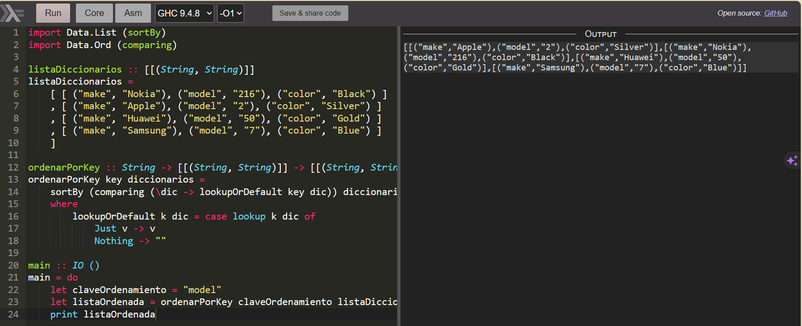
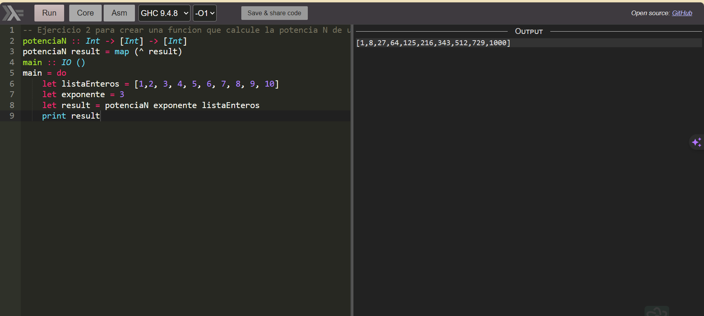
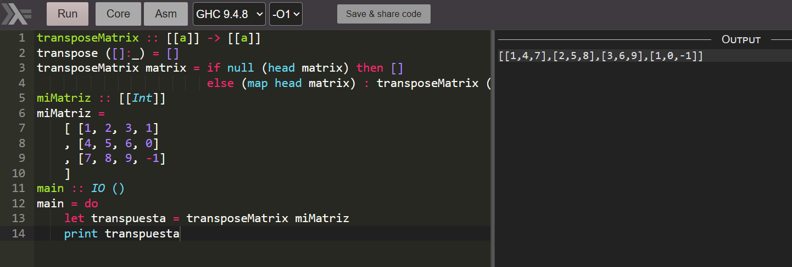
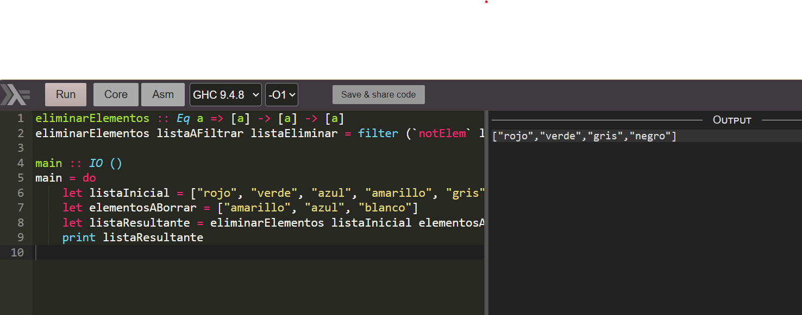

# Lab 12
* Diego Andres Alonzo Medinilla   20172

## De qué se trató

El laboratorio se trató de utilizar las funciones lambda para resolver algunos ejercicios en haskell.

## Ejercicio 1

## Ejercicio 2

## Ejercicio 3

## Ejercicio 4

